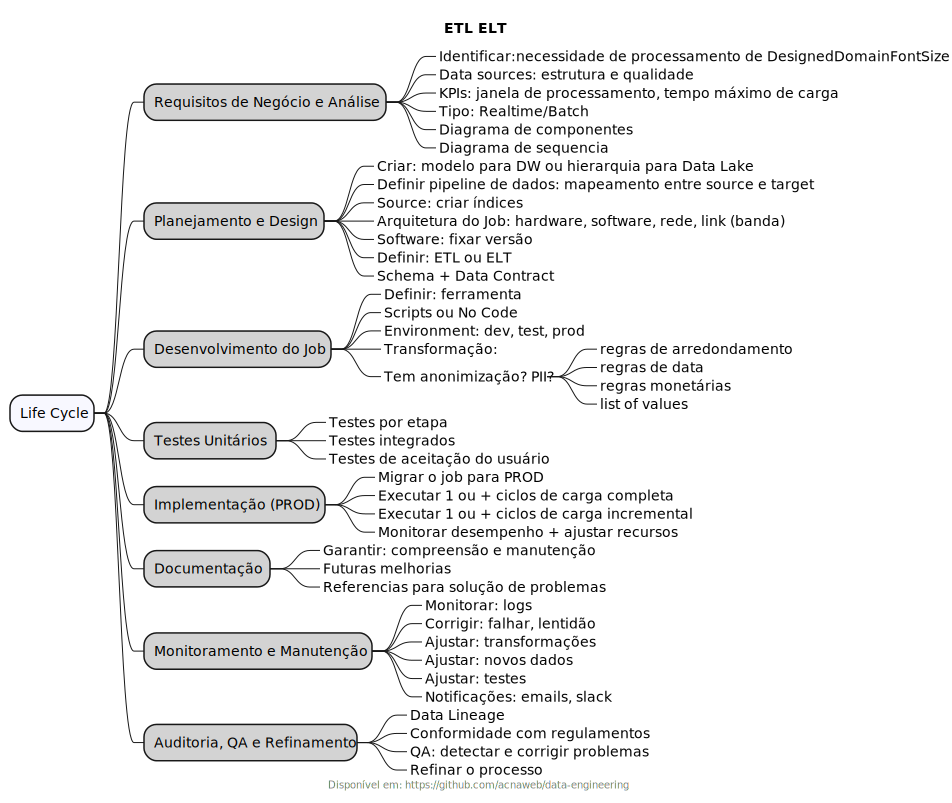
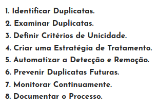
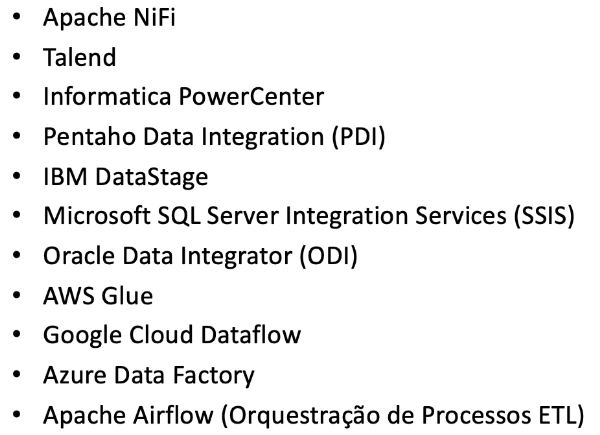
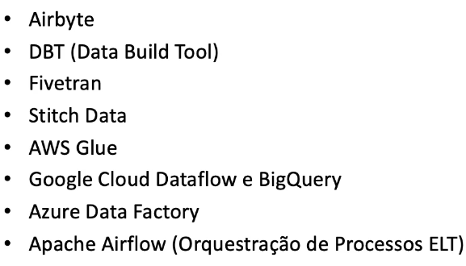

# Data Engineering

## ETL e ELT

## Transformação

### Dados faltantes

- Exclusão de casos completos (listwise deletion)
- Imputação

### Dados duplicados

### Validação e qualidade

## Modern Data Stack

- Scalable
- Flexible
- Efficient

## The Process

### Modeling

### Build Data Repository

### API Integration

### Security

### Data Governance

### Metadata

### Data Moviment / Data Preparing

- ETL 
    - Data Warehouse
    - Data Lakehouse
    - T - Stagging Area
    - (+)Resources Hardware
    - (+)Complexibility
    - (-)Flexibility
    - 

- ELT 
    - Schemaless
    - Data Lake
    - Data Lakehouse  
    - (+)Fastest
    - (-)Complexibility    
    - (+)Flexibility
    - T - Parallel
    - Raw Data - Preserved
    - 

## References

- https://mad.firstmark.com/
- https://www.airops.com/blog/etl-vs-elt
- https://rivery.io/blog/etl-vs-elt/
- https://www.integrate.io/blog/etl-vs-elt/

